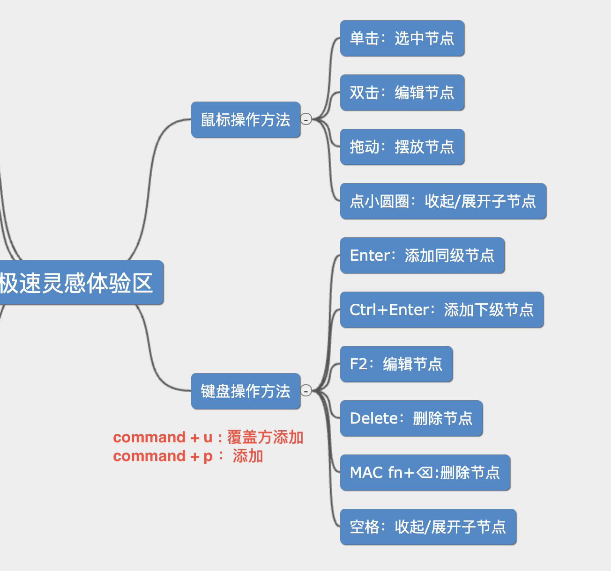

# 启动

==**环境**==：design_aid
`source /home/clq/anaconda3/bin/activate design_aid`

**==位置==**：`/media/ssd/design_aid/design_aid_tool/website`

启动

```shell
python manage.py runserver
```

# 键盘操作



# 大屏界面截图版